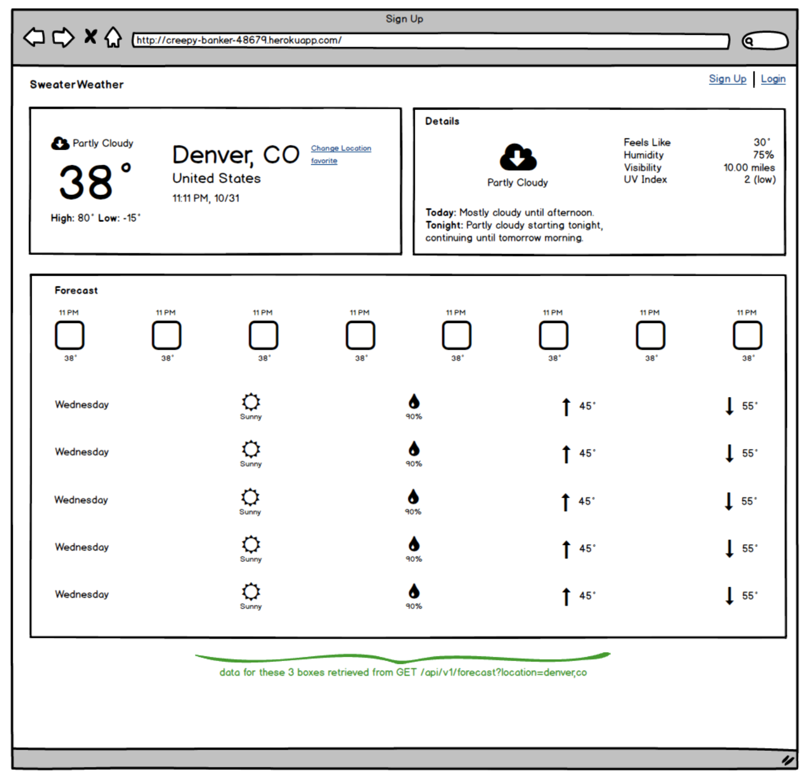

# Sweater Weather

This is a solo project completed at the Turing School of Software & Design - as the last project of Module 3 (Professional Rails Applications). The goal of this project was to build out a number of API endpoints which would provide the necessary information for creating a mock web page (below). In order to do achieve this, multiple external API's were called, Models and PORO's were created, and custom Serializers were used. 




The original project link can be found here: https://backend.turing.io/module3/projects/sweater_weather


## Endpoints
*no key is needed*

Weather for a city:  
GET `https://sweater-weather-3400.herokuapp.com/api/v1/forecast?location=denver,co`

Background images for a city:  
GET `https://sweater-weather-3400.herokuapp.com/api/v1/backgrounds?location=denver,co`


- Heroku

## External API's Used


## Local Setup (ff desired)
Obtain and define the following API keys in a `config/application.yml` file:
```
  Google Geocoding - ENV['GOOGLE_API_KEY']
  Darksky Weather Data - ENV['DARK_SKY_API_KEY']
  Unsplash Phots - ENV['UNSPLASH_API_KEY']
```
Clone down the repo
```
$ git clone https://github.com/CSheesley/sweater_weather
```
Install the gem packages
```
$ bundle install
```
Set up the database
```
$ rake db:{create,migrate,seed}
```
Run the test suite:
```
$ bundle exec rspec
```


## Versions

## Future Iterations
- build out accompanying front end app in JavaScript
- use JavaScript to ceratin time related keys to use client's time zone

